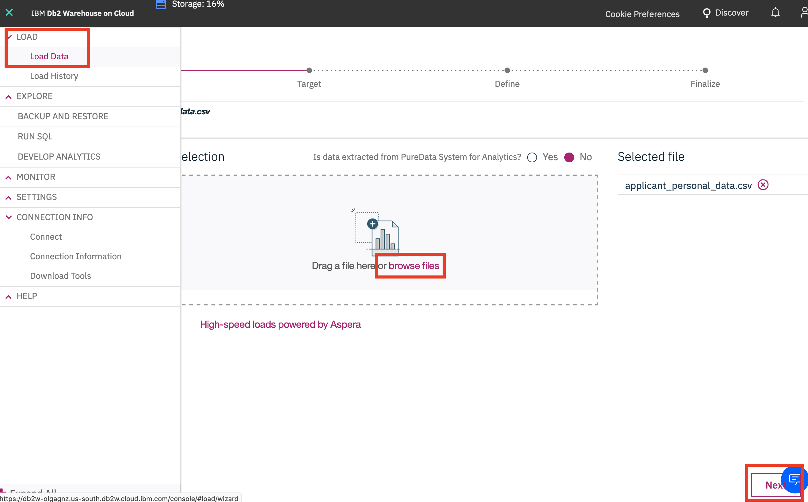
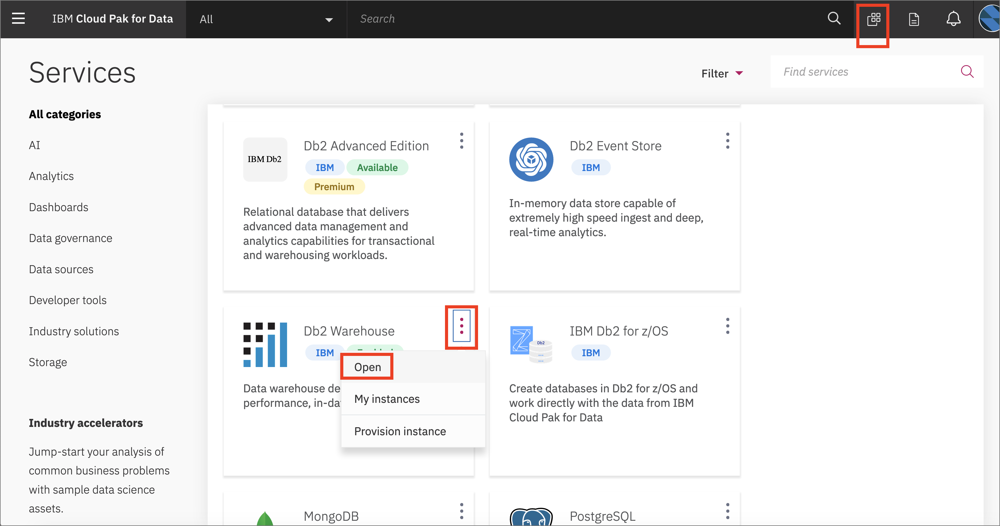
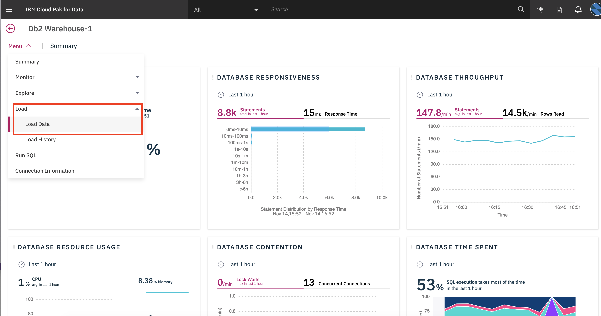
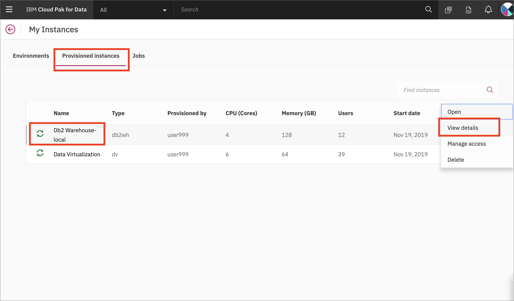
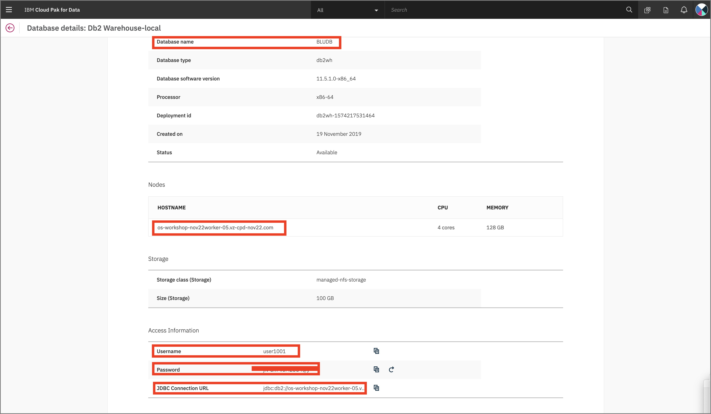
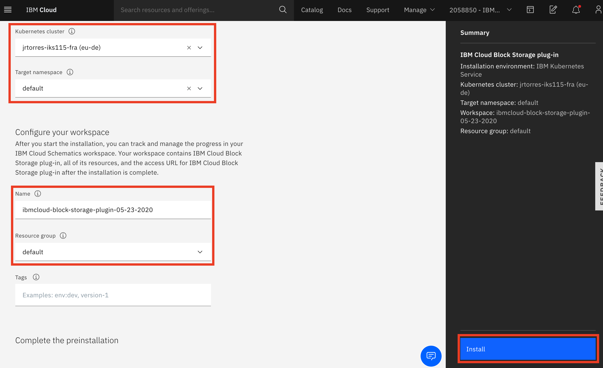
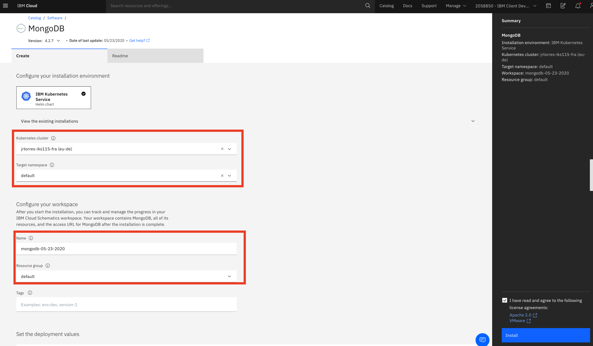
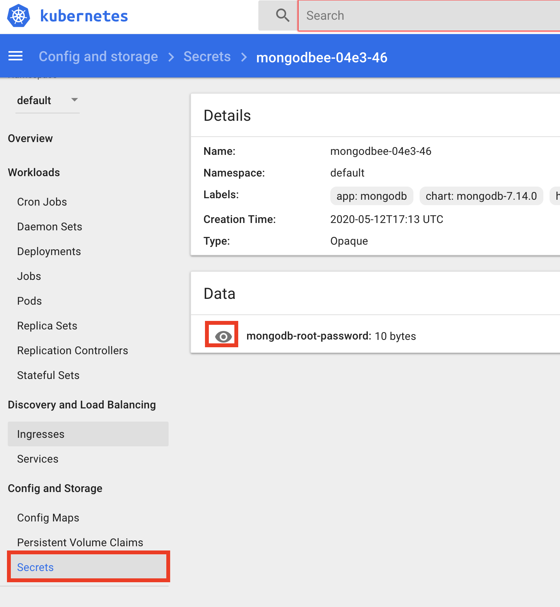
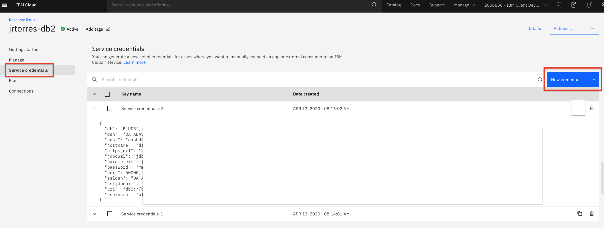

# Admin Guide - Setup and Configure Data Sources

The workshop simulates the real world data connection process by having data reside on one or more data sources which are then added as connection in Cloud Pak for Data. This workshop is using heterogeneous databases as its data sources as well as a couple of CSV files. Before delivering the workshop, you will need to set up a DB2 Warehouse instance and a MongoDB instance, then load them with data that will be consumed by participants. There are several deployment options available in this scenario:

* Local: Provision / use the DB2, DB2 Warehouse and MongoDB instances directly inside of Cloud Pak for Data.
* Remote: Provision / use the DB2, DB2 Warehouse and MongoDB instances externally on an IBM Cloud account.

The deployment selected will be based on the workshop requirements, CP4D cluster size, etc. For the workshop, it is suggested to deploy databases remotely in order to conserve resources on the CP4D cluser. There are three databases we use in this workshop:

1. [DB2 Warehouse](#create-and-load-db2-warehouse-instance)
1. [MongoDB](#create-and-load-mongodb-instance)
1. [DB2 Server](#create-db2-instance)

## Create and Load DB2 Warehouse Instance

You only need to create on DB2 Warehouse instance, follow the instructions for the Remote (cloud) instance or the local instance below.

### Remote DB2WhoC Instance

* Assuming you are logged in to an IBM Cloud account. Provision an instance of [DB2 Warehouse on IBM Cloud from the catalog.](https://cloud.ibm.com/catalog/services/db2-warehouse).

* Once the service is provisioned, Go to `Service Credentials` and click `New credential +`. Open `View credentials` and copy the credentials for use later.

   

#### Load Data

* Now go to `Manage` and click `Open Console`:

   

* From the upper-left (☰) hamburger menu click `Load` -> `Load data`:

   

* Choose `Browse file` and navigate to where you cloned this repository, then to `data/split/` and choose `applicant_financial_data.csv`, then click `Next`.

* Click `+ New Schema` and name it `CP4DCREDIT`.

* With the new schema selected, click `+ New table`. Under "New Table Name" type "APPLICANTFINANCIALDATA" and click `Create`, then `Next`. Accept the defaults and click `Next`. Click `Begin Load`.

* Repeat the data load steps for the `applicant_personal_data.csv` file, naming the table `APPLICANTPERSONALDATA`.

#### Get SSL Certificate

You will need an SSL certificate for Cloud Pak for Data to use the IBM Cloud DB2 Warehouse instance.

* In the DB2 Warehouse console, from the upper-left (☰) hamburger menu click `Connection Info` -> `Connection Information`. Then click `Download SSL Certificate`:

   

* You'll need to convert the SSL certificate from `.crt` to a `.pem` file using [openssl](https://www.openssl.org/). Run the following command:

  ```bash
  openssl x509 -in DigiCertGlobalRootCA.crt -out DigiCertGlobalRootCA.pem -outform PEM -inform DER
  ```

* Save this file for later use.

### Local DB2WhoC Instance

These instructions are for loading the data into the local CP4D version of DB2 Warehouse.

* You will need to already have done the `Provision instance` for DB2 Warehouse.

* Got to `Services` and click on `DB2 Warehouse` and click `Open`:

   

* Under `Menu` choose `Load` and `Load Data`:

   

* Choose `Browse file` and navigate to where you cloned this repository, then to `data/split/` and choose `applicant_financial_data.csv`, then click `Next`.

* Click `+ New Schema` and name it `CP4DCREDIT`.

* With the new schema selected, click `+ New table`. Under "New Table Name" type "APPLICANTFINANCIALDATA" and click `Create`, then `Next`. Accept the defaults and click `Next`. Click `Begin Load`.

* Repeat the data load steps for the `applicant_personal_data.csv` file, naming the table `APPLICANTPERSONALDATA`.

#### Get local connection info

* To get the connection info for you local DB2 Warehouse, go to the (☰) menu and click on the *My Instances* option.

   

* In *My instances* go to the *Provisioned instances* tab. Highlight you local DB2 Warehouse and click the 3 vertical dots on the far right, and then click `View Details`:

   

* Either keep this window open in a separate tab, or copy the required Connection info: *Host*, *Port*, *Database name*, *Username*, and *Password*. You can get the port from the *JDBC Connection URL*, i.e for the URL `jdbc:db2://os-workshop-nov22worker-05.vz-cpd-nov22.com:30290/BLUDB` the port is the number after the colin in the URL `30290`:

   

## Create and Load MongoDB Instance

Next we will provision and load data into a MongoDB instance. There are several options to run MongoDB (locally on CP4D, remotely on a cloud, remotely on an accessible server, remotely on a kubernetes service, etc). At this point in time, only the remote option deployed to a kubernetes cluster has been used.

> *Note: For the remote installation, the managed MongoDB service (i.e. Databases for MongoDB) may not be fully supported but check the CP4D documentation for current instructions.*

### Create IBM Kubernetes cluster to host MongoDB

* If you do not have an IKS cluster where you can deploy the MongoDB container, you will need to create it. Go to the [IKS service from the catalog](https://cloud.ibm.com/kubernetes/catalog/create)

* Select the appropriate parameters for your cloud account. These defaults for a minimal cluster are an example:

  * Orchestration Service: Kubernetes
  * Instrastructure: Classic
  * Resource group: default
  * Geography - North America, Availability - Single Zone, Worker Zone - Dallas 10.
  * Worker Nodes - 1
  * Flavor for worker pool - 2vCPU 4GB RAM

* Wait for the cluster to become available.

### Deploy MongoDB to IKS

* Before you can deploy mongoDB on the IKS cluster, you will need to add a block storage plugin to the cluster.

* From the cloud catalog, [install the block storage plugin](https://cloud.ibm.com/catalog/content/ibmcloud-block-storage-plugin). Select the IKS cluster you created from the drop down list. You can use the `default` namespace. Click the `Install` button.

   

* Once block storage is successfully installed, you can deploy MongoDB to IKS directly from the cloud catalog (alternatively you can use Helm to deploy MongoDB). Click on [MongoDB from the cloud catalog](https://cloud.ibm.com/catalog/content/mongodb-Qml0bmFtaS1tb25nb2Ri-global). Selecting the IKS cluster you created from the drop down list. You can use the `default` namespace.

   

* You can leave all the default parameters for the installation. One of these parameters is the root password, if you leave it unset it will be autogenerated. If you want to create your own password, fill it in before clicking the `Install` button

      

* After the installation successfully completes, you will need to expose the mongodb deployment to be accessible outside the IKS cluster (so CP4D can access it). There are several ways to do this (i.e ingress, loadbalancer, nodeport).

* As an example, use the following commands to get your deployment and expose it using a load balancer (**NOTE: the deployment name `mongodbee-04e3-46` will be the output found in the first command).

  ```bash
  kubectl get deployments
  ```

  ```bash
  kubectl expose deploy mongodbee-04e3-46 --port=27017 --target-port=27017 --type=LoadBalancer --name mongodb-svc-lb
  ```

    

* Save the `External IP` value as well as the exposed port (i.e. 27017) as you will need them later.

* If you did not specify your own mongodb root password, you need to get the generated value. You can do this either through the command line or by going to the kubernetes dashboard -> secrets. Save this password for use later:

    

### Load Data and Create User

With MongoDB running and accessible, you can now load the data into a new DB and collection. You can use the tool of your choosing (i.e Compass, command line, APIs, etc), to load the final `applicant_loan.data.csv` file.

* We have provided a sample python script to load data into MongoDB in the /scripts directory of this repository. Run the script to load the `applicant_loan_data.csv` data file into Mongo.

* The script expects three parameters:

  * data-csv-file = the full path to `applicant_loan_data.csv` file.
  * db-name = name of the database, use the name `CP4DCREDIT`
  * collection-name = name of collection where data will be stored, use the name `LOANS`

* To run the script, install the python packages necessary (pymongo), then from a terminal run:

   ```Bash
   python load_mongodb.py -data-csv-file applicant_loan_data.csv -db-name CP4DCREDIT -collection-name LOANS
   ```

    

* Once the database / collection has been created and the data has been loaded, we need to create a user in the database. To do so, you will need a mongo CLI client installed. From the client, run the following command:

  ``` bash
  db.createUser( { user: "mongodbuser", pwd: "REPLACE_WITH_YOUR_OWN_PASSWORD", roles: [ { role: "dbOwner", db: "CP4DCREDIT" } ] })
  ```

  

## Create DB2 Instance

If you are running the OpenScale Lab, you will need a DB2 Server instance (DB2 Warehouse is not supported but there are other databases that can be used in place of DB2). The DB2 instance can be local on CP4D or remote.

### Remote DB2 Instance

* Assuming you are logged in to an IBM Cloud account. Provision an instance of [DB2 Server from the catalog.](https://cloud.ibm.com/catalog/services/db2).

* Once the service is provisioned, Go to `Service Credentials` and click `New credential +`. Open `View credentials` and copy the credentials for use later.

   

__THIS SECTION IS COMPLETE, GO BACK AND CONTINUE WITH THE ADMIN GUIDE__
