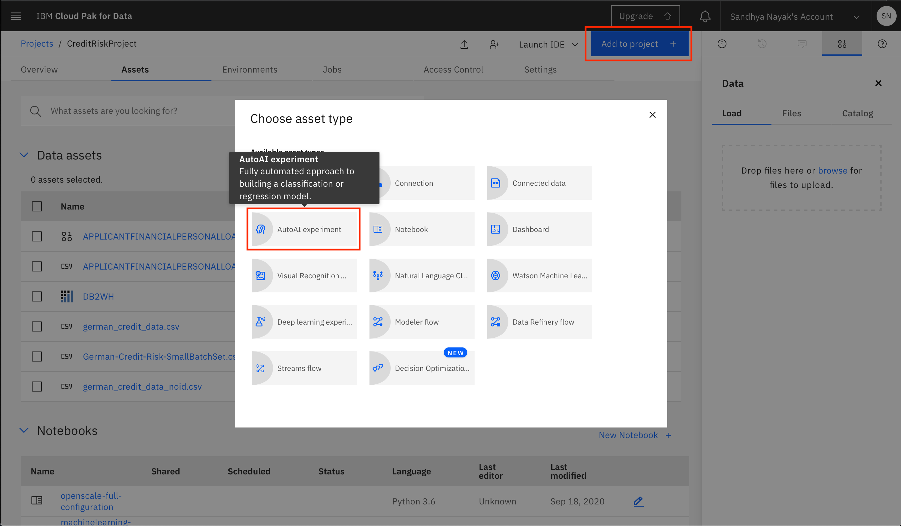
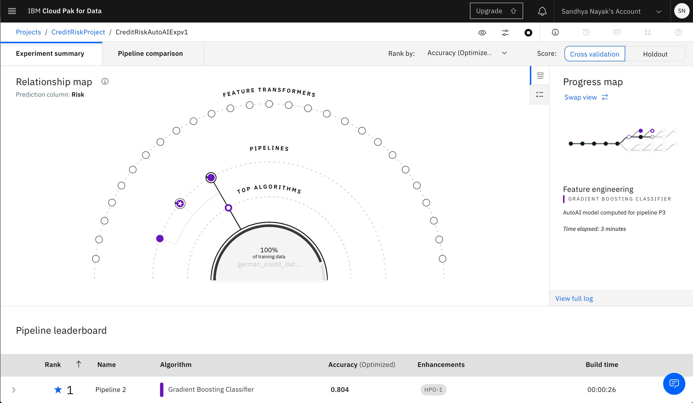
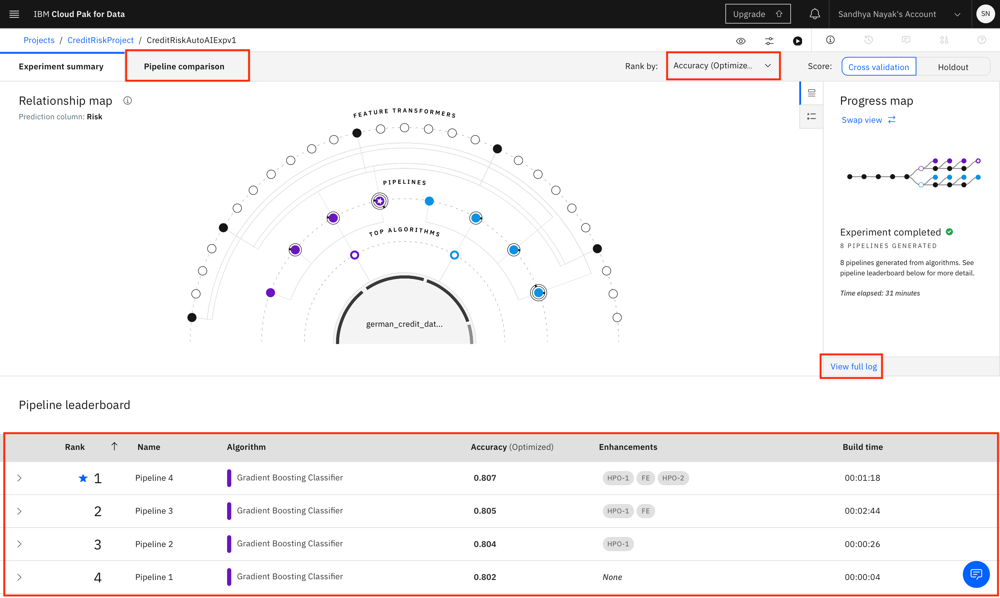
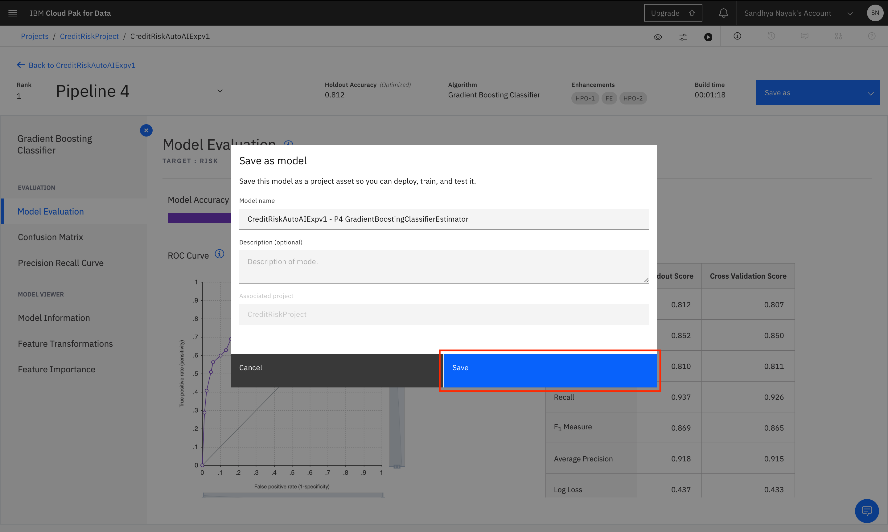
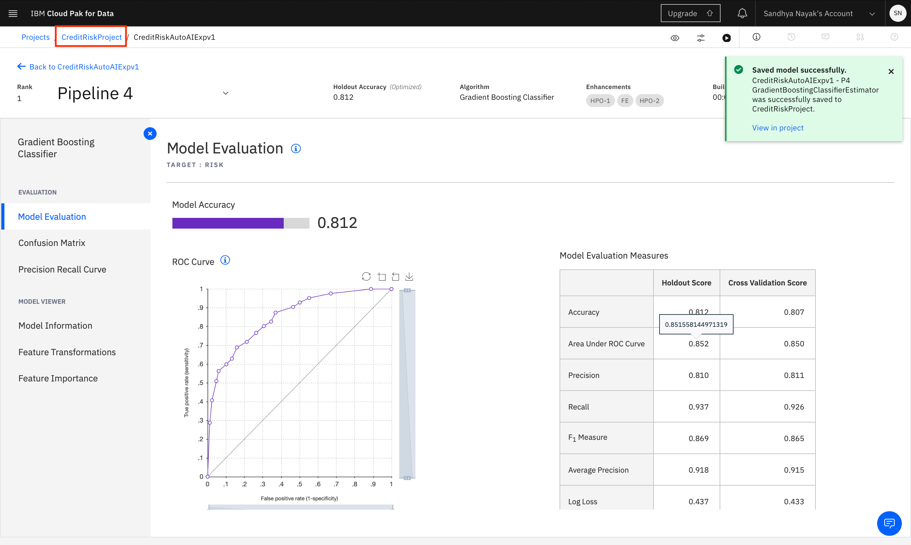
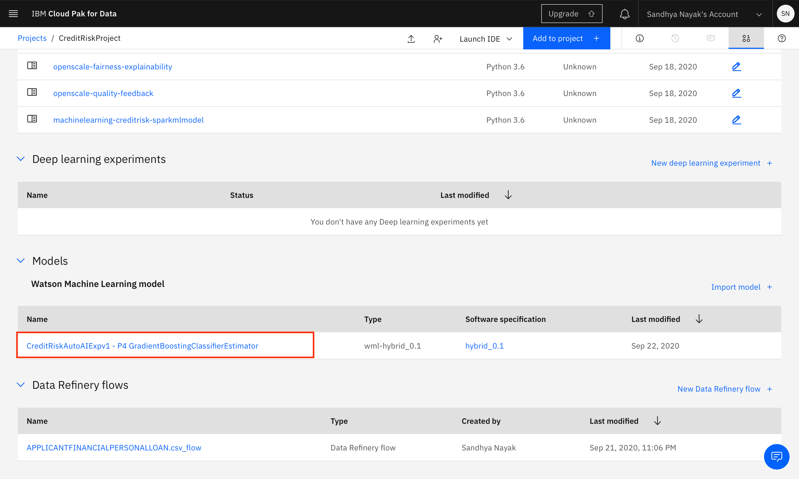

# Automate model building with AutoAI

For this part of the workshop, we'll learn how to use [AutoAI](https://www.ibm.com/support/producthub/icpdata/docs/content/SSQNUZ_current/wsj/analyze-data/autoai-overview.html).
AutoAI is a capability that automates machine learning tasks to ease the tasks of data scientists. It automatically prepares your data for modeling, chooses the best algorithm for your problem, and creates pipelines for the trained models.

This section is broken up into the following steps:

1. [Set up your AutoAI environment and generate pipelines](#1-set-up-your-autoai-environment-and-generate-pipelines)
2. [Save AutoAI Model](#2-save-autoai-model)
3. [Promote the model](#3-promote-the-model)

>*Note: The lab instructions below assume you have a project already with the assets necessary to build a model. If not, follow the instructions in the pre-work section to create a project.*

## 1. Set up your AutoAI environment and generate pipelines

* Go to your analytics project overview page.

* To start the AutoAI experience, click `Add to Project` from the top and select `AutoAI experiment`:

* Name your AutoAI experiment asset and leave the default compute configuration option listed in the drop-down menu. Then, click `Create`:

* To configure the experiment, we must give it the dataset to use. Click on the `Select from project` option.

* In the dialog, select the `german_credit_data_noid.csv` file and click the `Select asset` button.

* Once the dataset is read in, we will need to indicate what we want the model to predict. Under *Select prediction column*, find and click on the `Risk` row.

* AutoAI will set up defaults values for the experiment based on the dataset. This includes the type of model to build, the metrics to optimize against, the test/train split, etc. You could view/change these values under 'Experiment settings', however, for now we will accept the defaults and click the `> Run experiment` button.

* The AutoAI experiment will now run and the UI will show progress as it happens.

* The UI will show progress as different algorithms/evaluators are selected and as different pipelines are created & evaluated. You can view the performance of the pipelines that have completed by expanding each pipeline section.

* The experiment can take several minutes to run. Upon completion you will see a message that the pipelines have been created.

## 2. Save AutoAI Model

The AutoAI process follows this sequence to build candidate pipelines:

* Data pre-processing
* Automated model selection (Pipeline 1)
* Hyperparameter optimization (Pipeline 2)
* Automated feature engineering (Pipeline 3)
* Hyperparameter optimization (Pipeline 4)

You can review each pipeline and select to deploy the top performing pipeline from this experiment.

* Scroll down to see the *Pipeline leaderboard*. The top performing pipeline is in the first rank.

* The next step is to select the model that gives the best result by looking at the metrics. In this case, Pipeline 4 gave the best result with the metric "Area under the ROC Curve (ROC AUC)." You can view the detailed results by clicking the corresponding pipeline from the leaderboard:

* The model evaluation page will show metrics for the experiment, feature transformations that were performed (if any), which features contribute to the model, and more details of the pipeline.

* In order to deploy this model, we will Click on the `Save as model` button to save it.

* A window opens that asks for the model name, description (optional), and so on. You can accept the defaults or give your model a meaningful name/description and then click `Save`:

* You receive a notification to indicate that your model is saved to your project. Go back to your project main page by clicking on the project name on the navigator on the top left:

old:

* You will see the new model under *Models* section of the *Assets* page:

## 3. Promote the model

* Under the *Models* section of the *Assets* page, click the name of your saved model.

* To make the model available to be deployed, we need to make it available in the deployment space we previously set up. Click on the `Promote to deployment space`:

* To promote the asset, you must associate your project with a deployment space. Click `Associate Deployment Space`:

* You should have already created a deployment space in the *pre-work* section of the workshop. Click on `Existing` and choose that deployment then click the `Associate` button.

OLD:

* From the model page, once again click on the `Promote to deployment space`.

* This time you will see a notification that the model was promoted to the deployment space succesfully.

**We've successfully built and saved a machine learning model using AutoAI. Congratulations!**

## Conclusion

In this section we covered one approach to building machine learning models on Cloud Pak for Data. We have seen how AutoAI helps find an optimal model by automating tasks such as:

* Data Wrangling
* Model Algorithm Evaluation & Selection
* Feature Engineering
* Hyperparameter Optimization.
