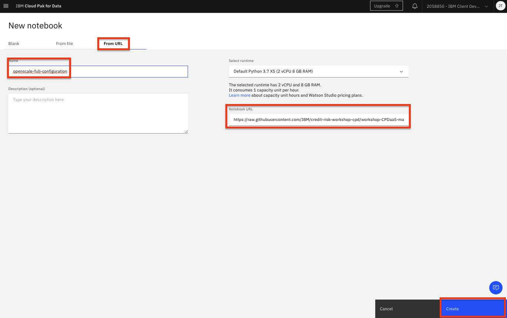

# Configure OpenScale in a Jupyter Notebook

There are several ways of configuring Watson OpenScale to monitor machine learning deployments, including the FastPath automatic configureation, using the GUI tool, a more manual configuration using the APIs, and some combintation of these.
For this exercise we're going to configure our OpenScale service by running a Jupyter Notebook. This provides examples of using the OpenScale Python APIs programatically.

This lab is comprised of the following steps:

1. [Open the notebook](#1-open-the-notebook)
2. [Update credentials](#2-update-credentials)
3. [Run the notebook](#3-run-the-notebook)
4. [Get transactions for Explainability](#4-get-transactions-for-explainability)

## 1. Open the notebook

If you [Created the Project](https://ibm-developer.gitbook.io/cloudpakfordata-credit-risk-workshop/getting-started/pre-work#create-a-new-project) using the [CreditRiskProject.zip](https://github.ibm.com/IBMDeveloper/cp4d-workshop-credit-risk/blob/master/projects/CreditRiskProject.zip) file, your notebook will be present in that project, under the `Assets` tab:


You may now skip to the next step [Update credentials](#2-update-credentials)

## Import the notebook (If you are not using the Project Import pre-work steps)

> NOTE: You should probably not need this step, and should only perform it if instructed to.

If, for some reason, you are not using the [Created the Project](https://ibm-developer.gitbook.io/cloudpakfordata-credit-risk-workshop/getting-started/pre-work#create-a-new-project) step in the Pre-work to import [CreditRiskProject.zip](https://github.ibm.com/IBMDeveloper/cp4d-workshop-credit-risk/blob/master/projects/CreditRiskProject.zip), then you will need to import the notebook file by itself. Use the following steps for that.

At the project overview click the *New Asset* button, and choose *Add notebook*.


On the next panel select the *From URL* tab, give your notebook a name, provide the following URL, and choose the Python 3.6 environment:

```bash
https://raw.githubusercontent.com/IBM/credit-risk-workshop-cpd/master/notebooks/ConfigureOpenScale.ipynb
```

> The notebook is hosted in the same repo as [the workshop](https://github.com/IBM/credit-risk-workshop-cpd)
>
> * **Notebook**: [ConfigureOpenScale.ipynb](../../notebooks/ConfigureOpenScale.ipynb)
> * **Notebook with output**: [with-output/ConfigureOpenScaleOutput.ipynb](../../notebooks/with-output/ConfigureOpenScale-with-output.ipynb)



When the Jupyter notebook is loaded and the kernel is ready then we can start executing cells.


### 2. Update credentials

* In the notebook section 1.2 you will add your ICP platform credentials for the `WOS_CREDENTIALS`.
* For the `url` field, change `https://w.x.y.z` to use the URL your ICP cluster. For this workshop, the cluster URL is: `https://zen1-cpd-zen1.openshift-1-92a26a6836b50cf42316a1e5b41d8a13-0001.us-east.containers.appdomain.cloud/`
* For the `username`, use your login username.
* For the `password`, user your login password.

### 3. Run the notebook

> **Important**: *Make sure that you stop the kernel of your notebook(s) when you are done, in order to prevent leaking of memory resources!*


Spend an minute looking through the sections of the notebook to get an overview. You will run cells individually by highlighting each cell, then either click the `Run` button at the top of the notebook. While the cell is running, an asterisk (`[*]`) will show up to the left of the cell. When that cell has finished executing a sequential number will show up (i.e. `[17]`).

### 4. Get transactions for Explainability

Under `8.9 Identify transactions for Explainability` run the cell. It will produce a series of UIDs for indidvidual ML scoring transactions. Copy one or more of them to examine in the next section.
